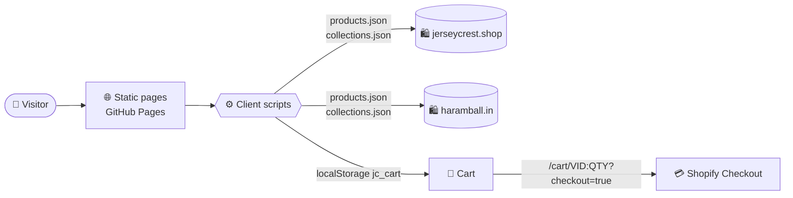

<div align="center">


# ⚽ UNREAL SPORTS HUB

### Premium football jerseys, retro classics & new-season kits — in a blazing-fast static storefront.

<br/>


<br/>

**[🌐 Visit the Store](https://adhleyrr.github.io/)** &nbsp;•&nbsp; **[✨ Features](#-features)** &nbsp;•&nbsp; **[🚀 Quick Start](#-quick-start)** &nbsp;•&nbsp; **[🧩 How It Works](#-how-it-works)** &nbsp;•&nbsp; **[🛠 Customise](#-customise)**

</div>

<br/>

---

## ✨ Features

<table>
<tr>
<td width="50%" valign="top">

### 🛍️ Shopping
- 🏷️ **Banner category tiles** with a modern 2-column mobile layout
- 🔎 **Instant search** across every product
- 👕 **Rich product pages** with gallery, sizes and sale prices
- 🛒 **Smooth cart** with quantity controls and live count badge
- ⚡ **Add to cart** or **Buy now** in one tap

</td>
<td width="50%" valign="top">

### 🌍 Catalogue
- 🏴 **Premier League** &nbsp; 🇪🇸 **La Liga** &nbsp; 🇩🇪 **Bundesliga**
- 🇮🇹 **Serie A** &nbsp; 🇫🇷 **Ligue 1** &nbsp; 🌐 **International**
- 🕰️ **Retro classics** &nbsp; 🧤 **Full sleeves** &nbsp; 🆕 **New season**
- 🔄 **Two stores, one design** — Jerseycrest + Haramball
- ⭐ **Customer reviews** and 📞 **contact** pages

</td>
</tr>
<tr>
<td width="50%" valign="top">

### 🎨 Experience
- 📱 **Mobile-first** with a bottom dock (Home · Menu · Search · Shop · Cart)
- 🌀 Smooth marquee, animated headings and hover effects
- 🖼️ Portrait banner cards with lazy-loaded images
- 🧭 Clean URLs and automatic link routing

</td>
<td width="50%" valign="top">

### ⚙️ Engineering
- 🚫 **No backend**, no database, no build tools
- 📡 **Live data** from public Shopify JSON endpoints
- 💾 Offline-friendly **`site_data.json`** snapshot
- 🔐 Secure **Shopify checkout** handles payments
- 🪶 Plain HTML, CSS and vanilla JS

</td>
</tr>
</table>

---

## 🧩 How It Works



| Step | What happens |
| :---: | --- |
| **1️⃣** | Pages are saved copies of the Jerseycrest theme, served as static files |
| **2️⃣** | `live.js` rewrites Shopify links (`/products/…`, `/collections/…`) to local pages |
| **3️⃣** | Scripts fetch live products and collections from both stores |
| **4️⃣** | The cart is kept in the browser, then handed to Shopify checkout |

---

## 🚀 Quick Start

```bash
# 1. Get the code
git clone https://github.com/<your-username>/<your-repo>.git
cd <your-repo>

# 2. Start a local server (pick one)
python3 -m http.server 8000
# or
npx serve .

# 3. Open the store
# 👉 http://localhost:8000
```

> [!NOTE]
> The site uses `fetch`, so run it through a local server instead of double-clicking `index.html`. You also need internet access, because products load live from the stores.

### ☁️ Deploy to GitHub Pages

1. Push everything to a repository, including the `assets/` folder
2. Open **Settings → Pages**
3. Choose **Deploy from a branch** → `main` → `/ (root)` → **Save**
4. Visit `https://<username>.github.io/<repo>/` after a minute

> [!TIP]
> All links are relative, so the site works from a sub-path. After each update, hard-refresh to skip cached scripts.

---

## 📂 Project Structure

```text
📦 unreal-sports-hub
 ┣ 🏠 index.html             Home page
 ┣ 🗂️ collection.html        Collections hub + single collection grid
 ┣ 🛍️ collections.html       All products
 ┣ 🏴 premier-league.html    ┐
 ┣ 🇪🇸 laliga.html            │
 ┣ 🇩🇪 bundesliga.html        │  League pages
 ┣ 🇮🇹 serie-a.html           │  (filtered by data-collection)
 ┣ 🇫🇷 ligue1.html            │
 ┣ 🌐 international.html     │
 ┣ 🆕 new-season.html        ┘
 ┣ 👕 product.html           Product detail
 ┣ 🛒 cart.html              Cart
 ┣ 🔎 search.html            Search
 ┣ ⭐ reviews.html           Customer reviews
 ┣ 📞 contact.html           Contact
 ┣ 🚧 404.html               Not found
 ┣ 🧭 live.js                Link router + local data loader
 ┣ 🗂️ collection-page.js     Collection tiles and grid
 ┣ 🏷️ haramball-loader.js    Haramball cards, league filters
 ┣ 👕 product-loader.js      Product page + add to cart / buy now
 ┣ 🛒 cart-loader.js         Cart rendering + checkout hand-off
 ┣ 💾 site_data.json         Local product & collection snapshot
 ┗ 🎨 assets/                Icons and images
```

---

## 📄 Pages

| | Page | Purpose |
| :---: | --- | --- |
| 🏠 | `index.html` | Landing page with banner categories, featured products and reviews |
| 🗂️ | `collection.html` | Collections hub, or one collection's products with `?store=&collection=` |
| 🛍️ | `collections.html` | Every product |
| ⚽ | League pages | Premier League, La Liga, Bundesliga, Serie A, Ligue 1, International, New Season |
| 👕 | `product.html` | Product detail, opened with `?handle=` |
| 🛒 | `cart.html` | Cart and checkout button |
| 🔎 | `search.html` | Search results, opened with `?q=` |
| ⭐ | `reviews.html` · `contact.html` | Info pages |

---

## 🧠 Scripts

<details>
<summary><b>🧭 &nbsp;live.js</b> — router and data loader</summary>

<br/>

- Intercepts link clicks and maps Shopify paths to local pages
- Holds the `localMap` table that sends collection handles to league pages or to `collection.html?store=jerseycrest&collection=<handle>`
- Loads `site_data.json` for local rendering

</details>

<details>
<summary><b>🗂️ &nbsp;collection-page.js</b> — collection tiles and grid</summary>

<br/>

- Renders the hub as **2-column banner cards** (3 on tablet, 4 on desktop)
- Uses the four homepage banners from the `BANNERS` map: La Liga 26/27, Premier League 26/27, Retro Jerseys, Full Sleeves Jerseys
- Other collections use their own image from `collections.json`, and a product photo only if none exists
- Featured collections are listed first, in homepage order
- Shares `jcBuildCard` with Haramball so every card looks identical

</details>

<details>
<summary><b>🏷️ &nbsp;haramball-loader.js</b> — Haramball products and filters</summary>

<br/>

- Fetches Haramball products and builds cards
- Filters league pages by keyword using `data-collection`
- Supported values: `premier-league` · `laliga` · `bundesliga` · `serie-a` · `ligue1` · `new-season` · `international` · `all`
- Links cards to `product.html?handle=…&store=haramball`
- Applies the [brand rules](#-brand-rules)

</details>

<details>
<summary><b>👕 &nbsp;product-loader.js</b> — product detail page</summary>

<br/>

- Reads `?handle=` and optional `&store=haramball`
- Fills title, gallery, price, sizes and description
- **Add to cart** keeps you on the page, **Buy now** goes to checkout
- Haramball variants are matched to Jerseycrest variants by size, because their IDs differ

</details>

<details>
<summary><b>🛒 &nbsp;cart-loader.js</b> — cart and checkout</summary>

<br/>

- Stores the cart in `localStorage` under `jc_cart`
- Renders items, quantity controls, remove and totals
- Updates count badges in the header and dock
- Builds `https://jerseycrest.shop/cart/<variantId>:<qty>,…?checkout=true`

</details>

---

## 🔗 URL Parameters

| Page | Parameter | Example |
| --- | --- | --- |
| 👕 `product.html` | `handle`, `store` | `product.html?handle=ac-milan-26-27-pulsic-serie-a-home-kit` |
| 🗂️ `collection.html` | `store`, `collection` | `collection.html?store=jerseycrest&collection=retro-jerseys` |
| 🔎 `search.html` | `q` | `search.html?q=messi` |

---

## 🛠 Customise

| 🎯 I want to… | 📍 Edit |
| --- | --- |
| Change a collection banner | `BANNERS` in `collection-page.js` |
| Reorder featured collections | `FIRST` in `collection-page.js` |
| Restyle the tiles (columns, spacing, text) | `injectTileStyles()` in `collection-page.js` |
| Route a new collection handle | `localMap` in `live.js` |
| Add a league filter | `COLLECTION_KEYWORDS` in `haramball-loader.js` + a `data-collection` value |
| Update the offline snapshot | Replace `site_data.json` |
| Change the favicon and logo | `assets/unreal-icon.png` |

### 🏷️ Brand Rules

Haramball names are rewritten for display:

| Original | Shown as |
| --- | --- |
| `haramball.in` | `UnrealSportsHub.in` |
| `haramball` | `UnrealSportsHub` |

Rules live in `BRAND_RULES` (`haramball-loader.js`) and `_BRAND_RULES` (`product-loader.js`). Update both when adding one.

---

## 🩺 Troubleshooting

<details>
<summary>🖼️ Collections show product photos or a single column</summary>

<br/>

Deploy the latest `collection-page.js` and hard-refresh. If one collection still shows a product photo, the store has no banner for it, so add one to `BANNERS`.

</details>

<details>
<summary>📡 Products don't load</summary>

<br/>

The site needs `jerseycrest.shop` and `haramball.in` to be reachable. Open the browser console and look for failed `products.json` or `collections.json` requests.

</details>

<details>
<summary>🛒 Cart is empty on another device</summary>

<br/>

Expected. The cart is stored per browser in `localStorage`.

</details>

<details>
<summary>📏 A Haramball item won't check out</summary>

<br/>

Its size must exist on the matching Jerseycrest product. Without a match it can't be sent to checkout.

</details>

<details>
<summary>⏳ Changes don't show after deploying</summary>

<br/>

GitHub Pages and browsers cache aggressively. Wait a minute, then hard-refresh.

</details>

---

## ⚠️ Known Limitations

- 🔌 Depends on third-party public APIs, so product data stops if they change or block access
- 🔢 Collection product counts are capped at 250
- 👤 No accounts, wishlist or order history
- 🎨 Theme CSS, fonts and some images load from `jerseycrest.shop`

---

## 🙌 Credits

- 🛍️ Theme and product data: [Jerseycrest](https://jerseycrest.shop) and [Haramball](https://haramball.in)
- 🧑‍💻 Storefront adaptation and client-side routing: **Unreal Sports Hub**

<br/>

<div align="center">

**⚽ Built for the love of the game.**

<sub>An independent storefront front end. Club names, logos and product names belong to their respective owners.</sub>

<br/>

[⬆ Back to top](#-unreal-sports-hub)

</div>
